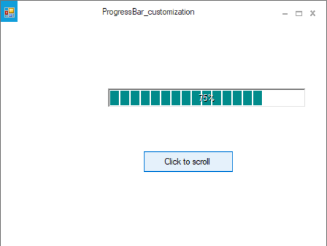

# How-to-continuously-scroll-the-ProgressBarAdv
This repository contains the sample that how to continuously scroll the ProgressBarAdv.

The ProgressBarAdv can be continuously scroll by using the timer_Tick event. By default, the Timer will be disabled. T ProgressBarAdv can be scroll continuously by enabling  the timer in the button_Click event and add the below given code in the timer_Tick event

Enable the timer in the button_Click event.

```C#
private void button1_Click(object sender, EventArgs e)
{
this.timer1.Enabled = true;
}
```

```VB
Private Sub button1_Click(ByVal sender As Object, ByVal e As EventArgs) Handles button1.Click
Me.timer1.Enabled = True
End Sub
```

Add the below given code in the timer_Tick event

```C#
private void timer1_Tick(object sender, EventArgs e)
{
if (this.progressBarAdv1.Value < 100)

this.progressBarAdv1.Value++;

else

this.progressBarAdv1.Value = 0;
}
```

```VB
Private Sub timer1_Tick(ByVal sender As Object, ByVal e As EventArgs) Handles timer1.Tick
If Me.progressBarAdv1.Value < 100 Then

Me.progressBarAdv1.Value += 1

Else

Me.progressBarAdv1.Value = 0
End If
End Sub
```

Output:


